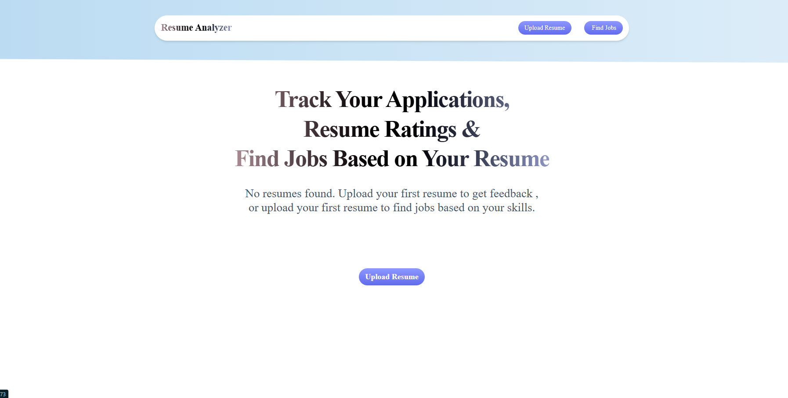
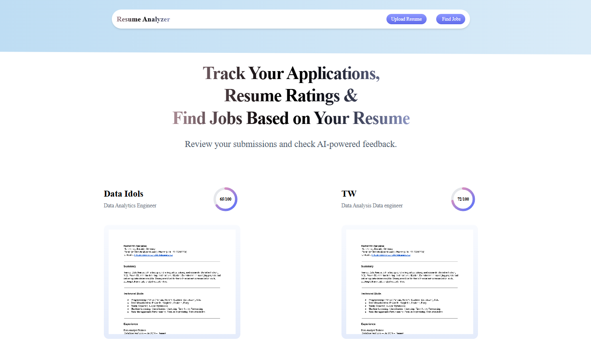
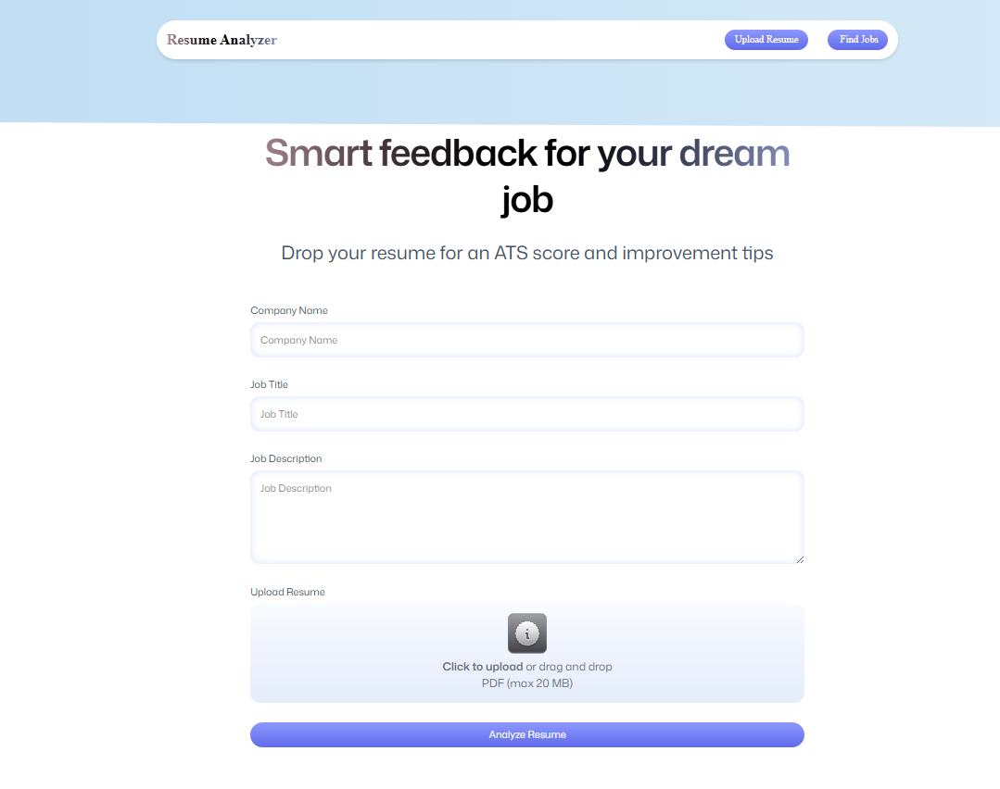
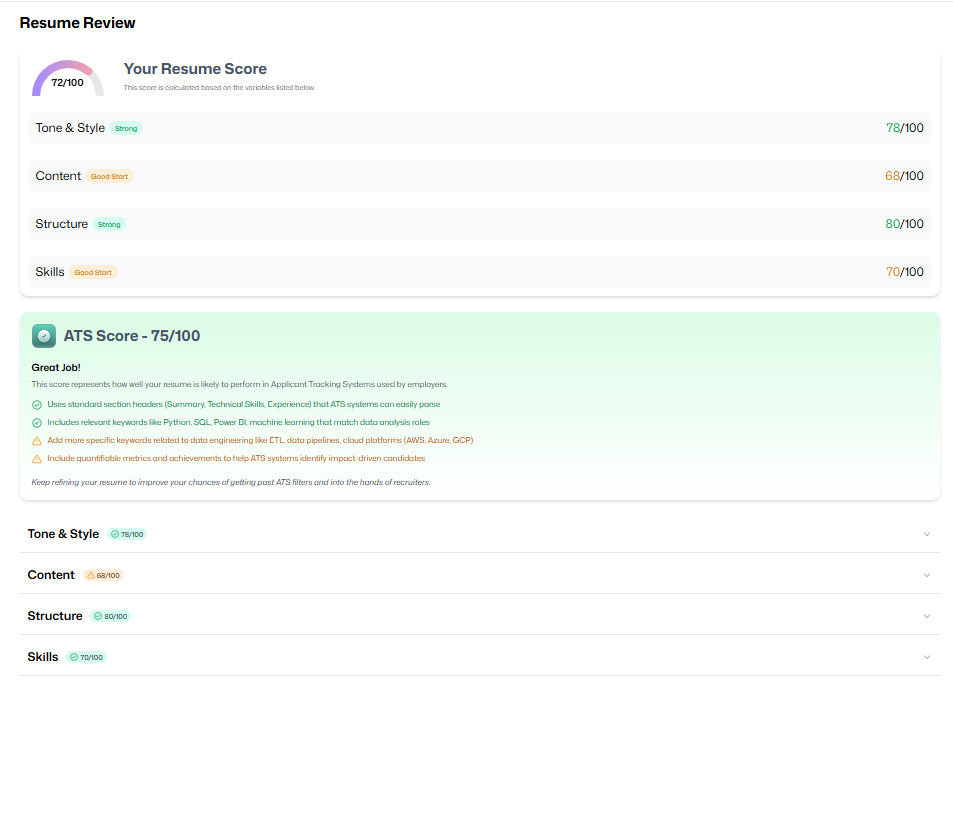
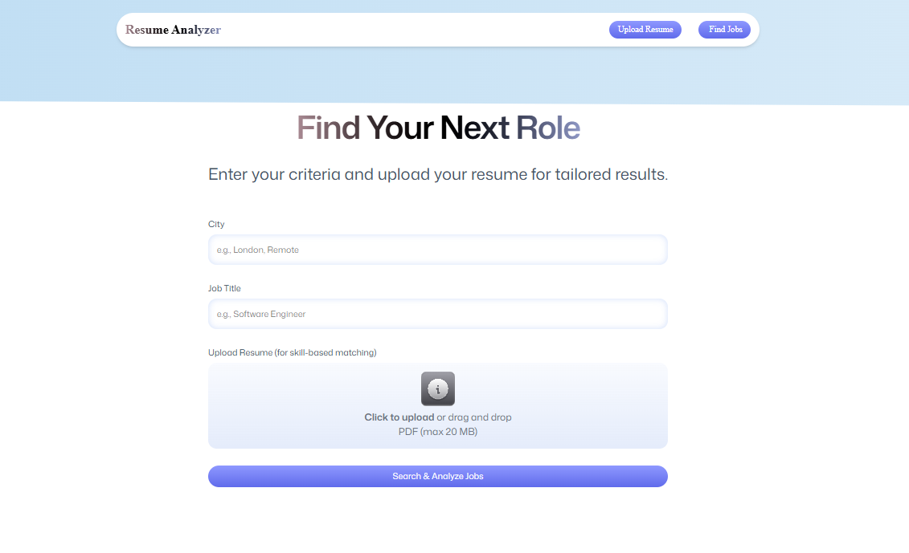
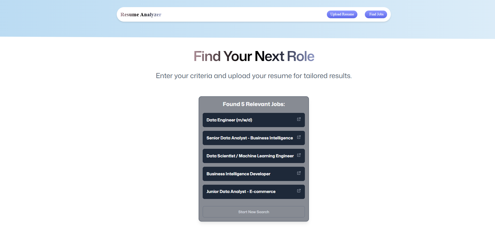

# 🚀 Resume Analyzer & Job Finder

A modern web application built with **React** and **Tailwind CSS** that leverages the **Puter AI** platform to provide instant resume analysis, ATS score feedback, and personalized job recommendations based on extracted skills.
Resume Analyzer & Job Finder is a powerful, full-featured application leveraging React, Tailwind CSS, PDF.js, and the Puter AI ecosystem.

## ✨ Features

- **ATS Score & Detailed Feedback:** Get real-time, AI-driven feedback on your resume tailored to a specific job description.
- **PDF to Image Conversion:** Seamlessly converts PDF resumes to images for AI vision analysis.
- **Skill Extraction:** Automatically extracts relevant skills from your resume.
- **Personalized Job Search:** Searches for relevant jobs based on your skills, target title, and location.
- **Modern UI:** Fast, responsive, and aesthetically pleasing interface built with Tailwind CSS.

## 💻 Tech Stack

| Category          | Technology             | Purpose                                                              |
| ----------------- | ---------------------- | -------------------------------------------------------------------- |
| **Frontend**      | React, TypeScript      | Main application framework.                                          |
| **Styling**       | Tailwind CSS           | Utility-first CSS framework for rapid UI development.                |
| **Cloud/Backend** | Puter SDK (FS, AI, KV) | Handles file storage, AI processing, and key-value data persistence. |
| **Utilities**     | PDF.js                 | Client-side conversion of PDF documents to PNG images.               |
| **Routing**       | React Router           | Handles navigation between the main pages.                           |

## 🖼️ Application Flow Screenshots

The application guides the user through two main workflows: Resume Analysis and Job Search.

### 1. Home / Landing Page

The initial view, typically featuring the app name and navigation.

<div align="center">

</div>
<br>
<div align="center">

</div>
<br>

### 2. Resume Upload and Job Details Form

The user navigates to the `/upload` route and inputs the necessary job details (Company, Title, Description) alongside uploading their resume.

<div align="center">

</div>
<br>

### 3. AI Analysis in Progress

When the user submits the form, the application enters a processing state, showing real-time status updates as the file is uploaded, converted, and analyzed by the AI.

### 4. Resume Feedback & ATS Score Result

After processing, the user is redirected to a page displaying the detailed, structured feedback provided by the AI, including an ATS rating and areas for improvement.

<div align="center">

</div>
<br>

### 5. Find Jobs Search Form

The user navigates to the `/find-jobs` route where they can input their target city and job title, and optionally re-upload their resume for skill-based matching.

<div align="center">

</div>
<br>

### 6. Personalized Job Search Results

The application extracts skills from the uploaded resume (or proceeds without one), constructs a query, and uses the Puter AI's web-search capability to list relevant, clickable job links tailored to the user's profile and criteria.

<div align="center">

</div>
<br>

## ⚙️ Setup and Installation

### Prerequisites

- Node.js (LTS recommended)
- A Puter account (for API access, file storage, and AI services)

### Steps

1. **Clone the Repository:**

```bash
git clone [YOUR_REPO_URL]
cd resume-analyzer-job-finder

```

2. **Install Dependencies (using npm or yarn):**

```bash
npm install
# or
yarn install

```

3. **Configure Puter:**

- Set up your Puter API keys and configuration, typically in a `.env` file or within your application's setup (e.g., `~/lib/puter.ts`). Ensure your `usePuterStore` hook is correctly configured for `fs`, `ai`, and `kv` access.

4. **Copy PDF.js Worker:**
   Due to the `pdfjs-dist` requirement for a specific worker file path, you must copy the worker script into your public directory:

```bash
cp node_modules/pdfjs-dist/build/pdf.worker.min.mjs public/

```

_(Ensure the version of this worker file matches the imported library version.)_ 5. **Start the Development Server:**

```bash
npm run dev
# or
yarn dev

```

### Installation

Install the dependencies:

```bash
npm install
```

### Development

Start the development server with HMR:

```bash
npm run dev
```

Your application will be available at `http://localhost:5173`.

## Building for Production

Create a production build:

```bash
npm run build
```

## Deployment

### Docker Deployment

To build and run using Docker:

```bash
docker build -t my-app .

# Run the container
docker run -p 3000:3000 my-app
```

The containerized application can be deployed to any platform that supports Docker, including:

- AWS ECS
- Google Cloud Run
- Azure Container Apps
- Digital Ocean App Platform
- Fly.io
- Railway

### DIY Deployment

If you're familiar with deploying Node applications, the built-in app server is production-ready.

Make sure to deploy the output of `npm run build`

```
├── package.json
├── package-lock.json (or pnpm-lock.yaml, or bun.lockb)
├── build/
│   ├── client/    # Static assets
│   └── server/    # Server-side code
```

## Styling

This template comes with [Tailwind CSS](https://tailwindcss.com/) already configured for a simple default starting experience. You can use whatever CSS framework you prefer.

---

If you have suggestions, feature ideas, or find a bug, please open an issue or submit a pull request!
